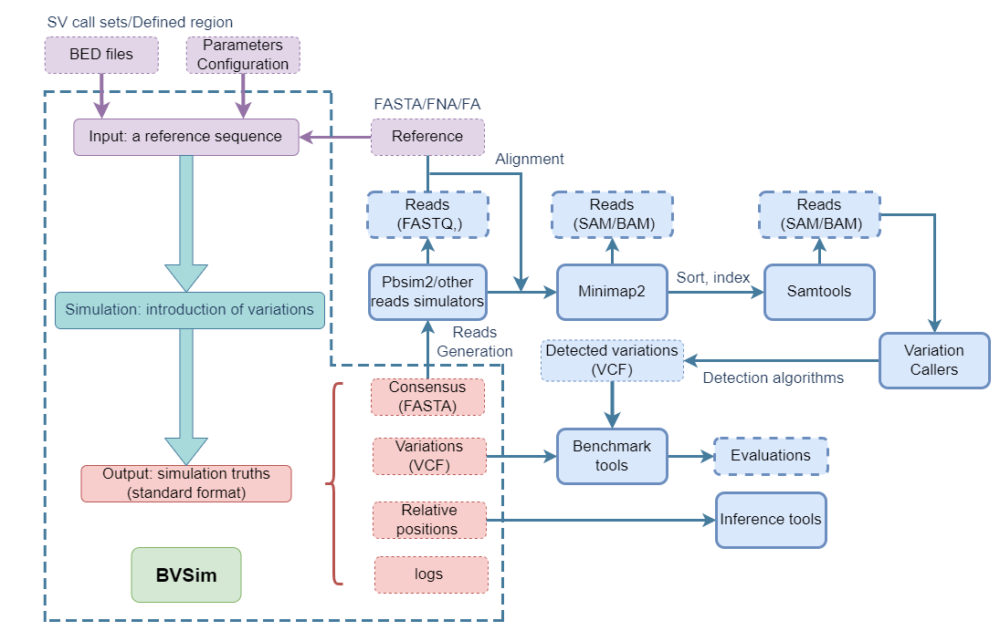

# BVSim: A Benchmarking Variation Simulator Mimicking Human Variation Spectrum

[](https://github.com/YongyiLuo98/BVSim)
## Table of Contents

- [Getting Started](#getting-started)
- [Installation](#installation)
- [General Functions and Parameters](#parameters)
  - [Shared Parameters](#shared-parameters)
    - [Write the Relative Positions of Simulated Variations](#write)
    - [User-defined Block Regions with No Variations](#block)
  - [Uniform Mode](#uniform-mode)
  - [Complex SV Mode](#complex-sv-mode)
    - [Parameters for CSV Mode](#parameters-for-csv-mode)
  - [Uniform Parallel Mode](#uniform-parallel-mode)
    - [Parameters for Uniform parallel Mode](#parameters-for-uniform-parallel-mode)
  - [Wave Mode](#wave-mode)
    - [User-defined Sample(s) and Input BED File Requirements](#requirements-for-the-bed-file)
    - [Generate a BED File for a Single Sample](#generating-a-bed-file-for-a-single-sample-in-wave-mode)
    - [Job Submission for Single Sample (BED Format)](#job-submission-for-wave-mode-single-sample)
    - [Generating BED Files for Multiple Samples](#generating-bed-files-for-multiple-samples-in-wave-mode)
    - [Job Submission for Multiple Samples (BED Format)](#job-submission-for-wave-mode-multiple-samples)
    - [Important Note on File Placement](#important-note-on-file-placement)
    - [Parameters for Wave Mode](#parameters-for-wave-mode)
  - [Wave Region Mode](#wave-region-mode)
    - [Extract User-defined Regions (e.g. TR region) and Generate the BED File](#step-1-extract-tr-regions)
    - [Job Submission for Single Sample (BED Format)](#job-submission-for-wave-region-mode-single-sample)
    - [Parameters for Wave Region Mode](#parameters-for-wave-region-mode)
  - [Human Genome](#human-genome)
- [Uninstallation for Updates](#uninstallation)
- [Workflow of BVSim](#workflow)
- [Definitions of SVs Simulated by BVSim](#definitions)

## <a name="getting-started"></a>Getting Started

To get started with BVSim, follow these steps to install and run the simulator:

```sh
# Create an envrionment called BVSim and install the dependencies
conda create -n BVSim python=3.11 numpy pandas biopython scipy seaborn psutil
conda activate BVSim
# Run the following to install pysam or use the latest guide
conda config --add channels defaults
conda config --add channels conda-forge
conda config --add channels bioconda
conda install pysam
# Installzation
## Clone the repository in your home path
cd your_home_path
git clone https://github.com/YongyiLuo98/BVSim.git
## Navigate to the ~/BVSim/main directory and install the package
pip install your_home_path/BVSim/main/.

# Verify the installation in your home path
cd your_home_path
python -m BVSim --help
python -m BVSim -h

## Run a toy example with a specified reference in the cloned folder
conda activate BVSim
python -m BVSim -ref 'your_home_path/BVSim/empirical/sub_hg19_chr1.fasta' -seed 0 -rep 0 -write -snp 2000
## If you prefer using the default reference, simply execute
cd your_home_path
python -m BVSim


# Generate variations with specific parameters
cd your_home_path
python -m BVSim -seed 1 -rep 1 -snp 2000

# To write out the relative positions, use the following command
python your_home_path/BVSim/main/write_SV.py your_home_path/BVSim/save/ BV_1_con0_chr1_SVtable.csv BV_1_con0_chr1_tem_ins_dic.npy

# Create a block intervals BED file
cd your_home_path
echo -e "0\t1000\n3000\t4000" > block_intervals.bed

# Run the simulator with block regions
cd your_home_path
python -m BVSim -seed 1 -rep 1 -write -snp 2000 -block_region_bed_url block_intervals.bed
```

## <a name="Installation"></a>Installation
### Create an envrionment called BVSim and install the dependencies
To start with, you need to install the dependent packages in an environment, for example called BVSim.
```bash
# Create an envrionment called BVSim and install the dependencies
conda create -n BVSim python=3.11 numpy pandas biopython scipy seaborn psutil
conda activate BVSim
# Run the following to install pysam or use the latest guide
conda config --add channels defaults
conda config --add channels conda-forge
conda config --add channels bioconda
conda install pysam
```
### Clone the Repository
Next, you need to clone the BVSim repository to your local machine. Execute the following command in your home directory:
```bash
cd your_home_path
git clone https://github.com/YongyiLuo98/BVSim.git
```
### Navigate to the Main Directory and Install the Package
Next, navigate to the .../BVSim/main/ directory to install the package:
```bash
pip install your_home_path/BVSim/main/.
```
### Verify the Installation
After installation, you can verify it from your home directory. Execute the following commands:
```bash
cd
python -m BVSim --help
python -m BVSim -h
```
Note: You can only call BVSim in the cloned repository directory, while the installation must take place in the BVSim/main/ directory.
#### Toy Example (Uniform mode):
```bash
conda activate BVSim
python -m BVSim -ref 'your_home_path/BVSim/empirical/sub_hg19_chr1.fasta' -seed 0 -rep 0 -write -snp 2000
```
or you can use the default reference to test the installation by type the following in your home path. If you do not give a saving path, the outputs will go to "your_home_path\BVSim\save\".

```bash
cd your_home_path
python -m BVSim 
```
## <a name="parameters"></a>Functions and Parameters

Five modes: uniform, uniform parallel, csv, wave, wave_region

### <a name="shared-parameters"></a>Shared Parameters
The BVSim package provides several functions (modes) and parameters for simulating genetic variations. Here is a table that introduces all the functions and different parameters:

| Parameter | Type | Description | Default |
| --- | --- | --- | --- |
| `-ref` | str | Input reference file | '.../BVSim/empirical/sub_hg19_chr1.fasta' |
| `-save` | str | Saving path | .../BVSim/save/ |
| `-seed` | int | Seed for random number generator | 999 |
| `-times` | int | Number of times | 10 |
| `-rep` | int | Replication ID | 5 |
| `-sv_trans` | int | Number of trans SV | 5 |
| `-sv_inver` | int | Number of inversion SV | 5 |
| `-sv_dup` | int | Number of tandem duplication | 5 |
| `-sv_del` | int | Number of SV deletion | 5 |
| `-sv_ins` | int | Number of SV insertion | 5 |
| `-snp` | float | SNV number or probability | 5 |
| `-snv_del` | float | SNV deletion number or probability | 5 |
| `-snv_ins` | float | SNV insertion number or probability | 5 |
| `-notblockN` | bool | Do not Block N positions | False |
| `-write` | bool | Write full results | False |
| `-delmin` | int | Minimum deletion length | 50 |
| `-delmax` | int | Maximum deletion length | 60 |
| `-insmin` | int | Minimum insertion length | 50 |
| `-insmax` | int | Maximum insertion length | 450 |
| `-dupmin` | int | Minimum duplication length | 50 |
| `-dupmax` | int | Maximum duplication length | 450 |
| `-invmin` | int | Minimum inversion length | 50 |
| `-invmax` | int | Maximum inversion length | 450 |
| `-dupmin` | int | Minimum duplication length | 50 |
| `-dupmax` | int | Maximum duplication length | 450 |
| `-transmin` | int | Minimum translocation length | 50 |
| `-transmax` | int | Maximum translocation length | 450 |
| `-block_region_bed_url` | str | local path of the block region BED file | None |

#### <a name="write"></a>Write the Relative Positions of Simulated Variations
If '-write' is present, in the '....SV_table_full.csv', the relative positions of all variations with respect to the consensus will be in the columns containing 'relative'. If this is not necessary, you can drop this parameter in your command as it extends the total time if there are lots of variations (1 min/ 10000 variations). However, it is still possible to update the relative positions after the simulation. We will save the intermediate documents for this, see the example below.

#### Toy Example:
```bash
cd your_home_path
python -m BVSim -seed 1 -rep 1 -snp 2000
```
In this case you generated default number of elementary SVs and micro indels, as well as 20000 SNPs saved in the default directory. However, you did not write out the relative positions.
If you type the following you will get a file called: 'full_BV_1_con0_chr1_SVtable.csv' in the same directory.
```bash
python your_home_path/BVSim/main/write_SV.py your_home_path/BVSim/save/ BV_1_con0_chr1_SVtable.csv BV_1_con0_chr1_tem_ins_dic.npy
```

#### <a name="block"></a>User-defined Block Regions with No Variations
The input of the '-block_region_bed_url' should be two columns of positions(start;end) without headers seperated by '\t'. To create a bed file, you can refer to the following example. In this case, positions from 0 to 999, from 3000 to 3999 cannot have any variation, so called blocked.

#### Toy Example:
```bash
cd your_home_path
echo -e "0\t1000\n3000\t4000" > block_intervals.bed
# uniform.py
cd your_home_path
python -m BVSim -seed 1 -rep 1 -write -snp 2000 -block_region_bed_url block_intervals.bed
```

### <a name="uniform-mode"></a>Uniform Mode
If you do not call any of the following parameters (-csv, -cores, -len_bins, -wave), the simulation will be generated one by one uniformly.

#### Toy Example (Uniform mode):
```bash
conda activate BVSim
python -m BVSim -ref 'hg19_chr1.fasta' -seed 0 -rep 0 -write -snp 2000
```
### <a name="complex-sv-mode"></a>Complex SV Mode
Add -csv to your command, 18 types of Complex Structure Variations can be generated.

* ID1: Tandem Inverted Duplication (TanInvDup)
* ID2: Dispersed Inverted Duplication (DisInvDup)
* ID3: Dispersed Duplication (DisDup)
* ID4: Inversion with 5’ or 3’ Flanking Deletion (DEL+INV/INV+DEL)
* ID5: 5’ Deletion and Dispersed Inverted Duplication (DEL+DisInvDup)
* ID6: 5’ Deletion and Dispersed Duplication (DEL+DisDup)
* ID7: Tandem Duplication and 3’ Deletion (TanDup+DEL)
* ID8: Tandem Inverted Duplication and 3’ Deletion (TanInvDup+DEL)
* ID9: Tandem Duplication, Deletion and Inversion (TanDup+DEL+INV)
* ID10: Tandem Inverted Duplication, Deletion and Inversion (TanInvDup+DEL+INV)
* ID11: Paired-Deletion Inversion (DEL+INV+DEL)
* ID12: Inversion with 5’ Flanking Duplication (DUP+INV)
* ID13: Inversion with 3’ Flanking Duplication (INV+DUP)
* ID14: Paired-Duplication Inversion (DUP+INV+DUP)
* ID15: Inversion with 5’ Flanking Duplication and 3’ Flanking Deletion (DUP+INV+DEL)
* ID16: Inversion with 5’ Flanking Deletion and 3’ Flanking Duplication (DEL+INV+DUP)
* ID17: Inverted Duplication with Flanking Triplication (DupTripDup-INV)
* ID18: Insertion with Deletion (INSdel)
#### Toy Example (CSV mode):
```bash
cd your_home_path
python -m BVSim -ref 'your_home_path/BVSim/empirical/sub_hg19_chr1.fasta' -save your_saving_url -seed 1 -rep 1 -csv -write -snp 2000
```
#### <a name="parameters-for-csv-mode"></a>Parameters for CSV Mode
The lengths of the CSVs follow different Gaussian distributions with modifiable means (-mu) and standard deviations (-sigma).
| Parameter | Type | Description | Default |
| --- | --- | --- | --- |
| `-csv_num` | int | Number for each type of CSV, superior to -csv_total_num | 0 |
| `-csv_total_num` | int | Total number for CSV, assign number of each type by empirical weights | 0 |
| `-num_ID1_csv to -num_ID18_csv` | int | Number of respective CSV types | 5 |
| `-mu_ID1 to -mu_ID18` | int | Mean of Gaussian distribution of CSV length | 1000 |
| `-sigma_ID1 to -sigma_ID18` | int | Standard deviation of Gaussian distribution of CSV length | 100 |

### <a name="uniform-parallel-mode"></a>Uniform Parallel Mode
Add -cores, -len_bins to your command, and write a .job file (task01.job) as follows (-c 5 means 5 cores, should be the same as -cores 5), parallel simulation will be allowed.

#### Toy Example (Uniform-parallel mode): task01.job
```bash
#!/bin/bash
#SBATCH -J uniform_parallel
#SBATCH -N 1 -c 5
#SBATCH --output=output.txt
#SBATCH --error=err.txt

source /opt/share/etc/miniconda3-py39.sh
conda activate BVSim
cd your_home_path
python -m BVSim -ref your_home_path/hg19/hg19_chr21.fasta -save your_home_path/test_data/BVSim/task03/ -cores 5 -len_bins 500000 -rep 3 -snp 200 -snv_del 200 -snv_ins 200 -write
conda deactivate
```
Submit the job file by:
```bash
sbatch task01.job
```
#### <a name="parameters-for-uniform-parallel-mode"></a>Parameters for Uniform parallel Mode

| Parameter | Type | Description | Default |
| --- | --- | --- | --- |
| `-cores` | int | Number of kernels for parallel processing | 1 |
| `-len_bins` | int | Length of bins for parallel processing | 50000 |

### <a name="wave-mode"></a>Wave Mode

In Wave mode, users can provide a `.bed` file generated from an empirical `.vcf` file (for example, from HG002) or multiple BED files derived from samples of a selected population (such as the 15 Cell samples). This functionality allows you to generate non-uniform insertions and deletions with various options.

#### <a name="requirements-for-the-bed-file"></a>User-defined Sample(s) and Input BED File Requirements

The BED file must adhere to the following requirements:

- **First Column**: Location (genomic position)
- **Second Column**: DEL/INS label (indicating if the variation is a deletion or insertion)
- **Third Column**: Length (absolute value of the variation)

Each column should be separated by a tab character (`\t`) and must not include headers. Additionally, each BED file should represent variations on the same sequence.

#### <a name="generating-a-bed-file-for-a-single-sample-in-wave-mode"></a>Generate a BED File for a Single Sample

To generate a single input BED file from the HG002 `.vcf` file of chromosome 21, you can use the following commands in your terminal:

```bash
# Download the VCF file and its index
wget https://ftp-trace.ncbi.nlm.nih.gov/ReferenceSamples/giab/release/AshkenazimTrio/HG002_NA24385_son/NIST_SV_v0.6/HG002_SVs_Tier1_v0.6.vcf.gz 
wget https://ftp-trace.ncbi.nlm.nih.gov/ReferenceSamples/giab/release/AshkenazimTrio/HG002_NA24385_son/NIST_SV_v0.6/HG002_SVs_Tier1_v0.6.vcf.gz.tbi

# Activate the bcftools environment
conda activate bcftools

# Generate the BED file using bcftools and awk
bcftools view -H -r 21 -i 'SVTYPE="INS" || SVTYPE="DEL"' /home/adduser/data/test_data/TGS/hg002/HG002_SVs_Tier1_v0.6.vcf.gz | \
awk -v OFS='\t' '{
    split($8, a, ";");
    for (i in a) {
        if (a[i] ~ /^SVTYPE/) {
            split(a[i], b, "=");
            svtype = b[2];
        }
        else if (a[i] ~ /^SVLEN/) {
            split(a[i], c, "=");
            svlen = c[2];
            if (svlen < 0) svlen = -svlen;  # Extract the absolute value of SV length
        }
    }
    print $2, svtype, svlen;  # Print the location, SV type, and absolute SV length
}' > /home/adduser/data/test_data/TGS/hg002/chr21_SV_Tier1.bed
```
##### <a name="job-submission-for-wave-mode-single-sample"></a>Job Submission for Single Sample (BED Format)

To utilize this single BED file, users should call '-indel_input_bed' in the command. Below is the example of a SLURM job script that you can use to run the Wave mode simulation with single empirical data:

```bash
#!/bin/bash
#SBATCH -J full_chr21_parallel
#SBATCH -N 1 -c 5
#SBATCH --output=output_chr21_wave.txt
#SBATCH --error=err_chr21_wave.txt

source /opt/share/etc/miniconda3-py39.sh
conda activate BVSim
cd your_home_path
python -m BVSim -ref your_home_path/hg19/hg19_chr21.fasta -save your_home_path/test_data/BVSim -seed 0 -rep 2 -cores 5 -len_bins 500000 -wave -indel_input_bed your_home_path/hg002/chr21_SV_Tier1_2.bed -mode empirical -snp 2000 -snv_del 1000 -snv_ins 100 -write
conda deactivate
```
Submit the job file by:
```bash
sbatch task02_single.job
```
#### <a name="generating-bed-files-for-multiple-samples-in-wave-mode"></a>Generating BED Files for Multiple Samples

In this section, we will outline the steps to generate `.bed` files for multiple cell samples from the original Excel spreadsheet, using the 15 Cell samples as an example.

##### Step 1: Download the Original Excel File

First, download the Excel file containing the cell samples data:

```python
import os

# Download the Excel file
os.system('wget https://ars.els-cdn.com/content/image/1-s2.0-S0092867418316337-mmc1.xlsx')

```
##### Step 2: Load and View the Data
Next, load the Excel file into a Pandas DataFrame and view the first few rows:
```python
import pandas as pd

# Read the Excel file into a DataFrame
file_path = '1-s2.0-S0092867418316337-mmc1.xlsx'
df = pd.read_excel(file_path, sheet_name=0)  # Choose the correct sheet based on the file

# Display the first 5 rows of the DataFrame
print(df.head(5))
```
##### Step 3: Filter the Data
Extract the required columns and rename the first column:
```python
# Extract the necessary columns
columns_to_keep = ['#CHROM', 'POS', 'END', 'ID', 'SVTYPE', 'SVLEN', 'MERGE_SAMPLES']
cell_df = df[columns_to_keep]

# List of all sample strings
samples = ['CHM1', 'CHM13', 'HG00514', 'HG00733', 'NA19240', 'HG02818', 'NA19434', 'HG01352', 'HG02059', 'NA12878', 'HG04217', 'HG02106', 'HG00268', 'AK1', 'HX1']
# selected population: the African population
AFR_samples = ['NA19240', 'HG02818', 'NA19434']

# Specify the columns to save in the BED file
columns_to_save = ['POS', 'SVTYPE', 'SVLEN']

# Extract rows where CHROM equals 'chr21'
chr21_df = cell_df[cell_df['CHROM'] == 'chr21']

# Display the first 10 rows for verification
print(chr21_df.head(10))

# Generate BED files for each sample in the AFR_samples list
for sample in AFR_samples:
    # Create a new DataFrame containing only rows where 'MERGE_SAMPLES' contains the current sample
    sample_df = chr21_df[chr21_df['MERGE_SAMPLES'].str.contains(sample)]

    # Specify the path for the new BED file
    bed_file_path = f'.../BVSim/empirical/{sample}_chr21.bed'

    # Save the specified columns to a BED file
    sample_df[columns_to_save].to_csv(bed_file_path, sep='\t', header=False, index=False)

```
#### <a name="job-submission-for-wave-mode-multiple-samples"></a>Job Submission for Multiple Samples (BED Format)

We provide an example of a Job submission script using SLURM for running the Wave mode with BVSim. This script utilizes the generated multiple sample BED files. Below is the example of a SLURM job script that you can use to run the Wave mode simulation with multiple samples:

```bash
#!/bin/bash
#SBATCH -J wave
#SBATCH -N 1 -c 5
#SBATCH --output=/home/project18/code/BVSim_code/wave2_out.txt
#SBATCH --error=/home/project18/code/BVSim_code/wave2_err.txt

source /opt/share/etc/miniconda3-py39.sh
conda activate BVSim
cd /home/project18/

python -m BVSim -ref your_home_path/hg38/chr21.fasta \
-save your_home_path/BVSim/task01/ -seed 0 -rep 1 -cores 5 \
-len_bins 500000 -wave -mode empirical -snp 2000 -snv_del 1000 -snv_ins 100 \
-write -file_list NA19240_chr21 HG02818_chr21 NA19434_chr21

conda deactivate
```
#### <a name="important-note-on-file-placement"></a>Important Note on File Placement
Ensure that both the single sample and multiple sample BED files are placed in the .../BVSim/empirical/ directory. This organization simplifies the command structure, allowing you to specify only the base names of the files (without extensions) directly in the -file_list option, as demonstrated in the script above.

#### <a name="parameters-for-wave-mode"></a>Parameters for Wave Mode

| Parameter | Type | Description | Default |
| --- | --- | --- | --- |
| `-cores` | int | Number of kernels for parallel processing | 1 |
| `-len_bins` | int | Length of bins for parallel processing | 50000 |
| `-wave` | bool | Run Wave.py script | False |
| `-mode` | str | Mode for calculating probabilities | 'probability' |
| `-sum` | bool | Total indel SV equals sum of the input bed | False |
| `-indel_input_bed` | str | Input single BED file | None |
| `-file_list` | str | Input list of multiple BED files | None |

##### Mode and Sum Parameters

The `-mode` parameter determines how the simulation calculates probabilities for insertions and deletions. It accepts two values:

- **'probability'**: In this mode, probabilities for insertions and deletions are derived from the empirical data provided in the input BED files. The total number of variations can be defined by the `-sum` parameter. If `-sum` is set to `True`, the total number of insertions or deletions will be the maximum of the calculated empirical total or the specified values in `-sv_ins` or `-sv_del`. This allows for flexibility in controlling the total number of SVs in the simulation.

- **'empirical'**: When set to this mode, the simulation directly uses the empirical values from the input data without any probability calculations. The total number of variations will be the sum of the provided empirical data.

The `-sum` parameter, when enabled, alters the total number of insertions and deletions based on the specified empirical data. If disabled, the simulation uses the fixed total values defined in `-sv_ins` and `-sv_del`, regardless of the empirical input.


### <a name="wave-region-mode"></a>Wave Region Mode

In Wave region mode, you can specify different INDEL probabilities using a BED file defined by `region_bed_url`. For example, if you want to increase the insertion and deletion probabilities in the tandem repeat (TR) regions of hg19, you can follow these steps.

#### <a name="step-1-extract-tr-regions"></a>Extract User-defined Regions (e.g. TR region) and Generate the BED File

First, extract the TR regions' positions from UCSC and create a BED file with two columns (start; end) separated by a tab character (`\t`).

You can generate the BED file using the following commands:

```bash
# Download the TR regions data
wget https://ftp-trace.ncbi.nlm.nih.gov/ReferenceSamples/giab/release/references/GRCh37/resources/hg19.simpleRepeat.bed.gz 
wget https://ftp-trace.ncbi.nlm.nih.gov/ReferenceSamples/giab/release/references/GRCh37/resources/hg19.simpleRepeat.bed.gz.tbi

# Extract the relevant columns and create the BED file
zcat hg19.simpleRepeat.bed.gz | awk 'BEGIN{OFS="\t"} {print $1, $2, $3}' > your_home_path/hg002/windows_TR.bed

# Merge overlapping intervals and remove duplicates
bedtools sort -i your_home_path/hg002/windows_TR.bed | bedtools merge -i stdin | awk 'BEGIN{OFS="\t"} {$4="TR"; print}' | uniq > your_home_path/hg002/windows_TR_unique.bed

# Filter for chromosome 21
awk '$1 == "chr21"' your_home_path/hg002/windows_TR_unique.bed > your_home_path/hg002/windows_TR_unique_chr21.bed

# Create a final BED file with start and end positions
awk '{print $2 "\t" $3}' your_home_path/hg002/windows_TR_unique_chr21.bed > your_home_path/hg002/chr21_TR_unique.bed
```
#### <a name="job-submission-for-wave-region-mode-single-sample"></a>Job Submission for Single Sample (BED Format)
In this example, we set the seed to `0` and use a replication ID of `4`. The job is configured to utilize `5` cores for parallel processing, with a bin size of `500,000`. We will generate `10,000` SNPs, along with `100` micro deletions and `100` micro insertions. The probabilities for these insertions and deletions are specified in the input BED file (`-indel_input_bed`) using the empirical mode (`-mode`). Additionally, we have set the probabilities for insertions (`-p_ins_region`) and deletions (`-p_del_region`) to approximately `0.6` for the total located in the TR region defined by `-region_bed_url`.

```bash
#!/bin/bash
#SBATCH -J full_chr21_parallel
#SBATCH -N 1 -c 5
#SBATCH --output=output_chr21_wave_region.txt
#SBATCH --error=err_chr21_wave_region.txt

source /opt/share/etc/miniconda3-py39.sh
conda activate BVSim
cd your_home_path
python -m BVSim -ref your_home_path/hg19/hg19_chr21.fasta -save your_home_path/test_data/BVSim -seed 0 -rep 4 -cores 5 -len_bins 500000 -wave_region -indel_input_bed your_home_path/hg002/chr21_SV_Tier1.bed -mode empirical -snp 10000 -snv_del 100 -snv_ins 100 -write -p_del_region 0.6 -p_ins_region 0.6 -region_bed_url your_home_path/hg002/chr21_TR_unique.bed
conda deactivate
```

Submit the job file using the following command:
```bash
sbatch task03.job
```
#### <a name="parameters-for-wave-region-mode"></a>Parameters for Wave Region Mode
The table below summarizes the parameters available for Wave region mode:
| Parameter | Type | Description | Default |
| --- | --- | --- | --- |
| `-cores` | int | Number of kernels for parallel processing | 1 |
| `-len_bins` | int | Length of bins for parallel processing | 50000 |
| `-wave` | bool | Run Wave.py script | False |
| `-mode` | str | Mode for calculating probabilities | 'probability' |
| `-sum` | bool | Total number of insertions and deletions equals sum of the input bed | False |
| `-indel_input_bed` | str | Input single BED file | None |
| `-file_list` | str | Input list of multiple BED files | None |
| `-wave_region` | bool | Run Wave_TR.py script | False |
| `-p_del_region` | float | Probability of SV DEL in the user-defined region for deletion | 0.5 |
| `-p_ins_region` | float | Probability of SV INS in the user-defined region for insertion | 0.5 |
| `-region_bed_url` | str | Path of the BED file for the user-defined region | 'your_home_path/hg002/chr21_TR_unique.bed' |

### <a name="human-genome"></a>Human Genome
For the human genome, we derive the length distributions of SVs from HG002 and the 15 representative samples. For SNPs, we embed a learned substitution transition matrix from the dbSNP database. With a user-specified bin size, BVSim learns the distribution of SV positions per interval. It can model the SVs per interval as a multinomial distribution parameterized by the observed frequencies in HG002 (GRCh37/hg19 as reference) or sample the SV numbers per interval from a Gaussian distribution with the mean and standard deviation computed across the 15 samples (GRCh38/hg38 as reference). Calling ‘-hg19’ or ‘-hg38’ and specifying the chromosome name can activate the above procedures automatically for the human genome.

In the following example, we use 5 cores and 500,000 as length of the intervals. The reference is chromosome 21 of hg19, so we call "-hg19 chr21" in the command line to utilize the default procedure. In addition, we generated 1,000 SNPs, 99 duplications, 7 inversions, 280 deletions, and 202 insertions. The ratio of deletions/insertions in the tandem repeat regions with respect to the total number is 0.810/0.828. We also set the minimum and maximum lengths of some SVs.
#### Toy example (-hg19)
```bash
#!/bin/bash
#SBATCH -J 0_hg19_chr21
#SBATCH -N 1 -c 5
#SBATCH --output=output.txt
#SBATCH --error=err.txt

source /opt/share/etc/miniconda3-py39.sh
conda activate BVSim
cd your_home_path
python -m BVSim -ref your_home_path/hg19/hg19_chr21.fasta -save your_home_path/test_data/BVSim/ -seed 0 -rep 0 -cores 5 -len_bins 500000 -hg19 chr21 -mode probability -snp 1000 -sv_trans 0 -dup 99 -sv_inver 7 -sv_del 280 -sv_ins 202 -snv_del 0 -snv_ins 0 -p_del_region 0.810 -p_ins_region 0.828 -region_bed_url /home/project18/data/test_data/TGS/hg002/chr21_TR_unique.bed -delmin 50 -delmax 2964912 -insmin 50 -insmax 187524
conda deactivate
```


## <a name="uninstallation"></a>Uninstallation for Updates
To update to the latest version of BVSim, you can uninstall and delete the cloned files. Then, try to clone from the new repository and install again.
```bash
cd your_home_path
pip uninstall BVSim
```
## <a name="workflow"></a>Workflow of BVSim
The following figure illustrates the workflow of BVSim, encapsulated within a dashed box, and demonstrates how the output files interact with read simulators, the alignment tool Minimap2, Samtools, and evaluation tools.

## <a name="definitions"></a>Definitions of SVs Simulated by BVSim

